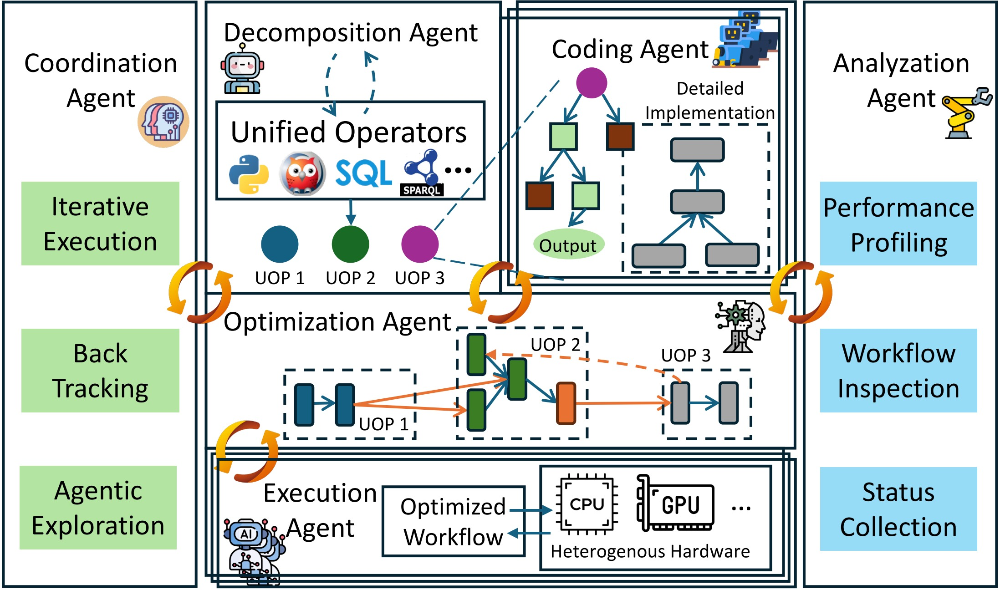

# NSDS: A Neural-Symbolic Data System for Geospatial Reasoning
We propose NSDS (Neural-Symbolic Data System), a framework designed to complete complex reasoning tasks by integrating neural perception with symbolic reasoning. This project demonstrates the capabilities of NSDS through a geolocation inference experiment, which aims to infer the precise location of a real-world image containing multiple semantic entities by fusing symbolic reasoning and neural inference.
The execution plan for NSDS includes three main components:
1.  An image reasoning model (**YOLO**)
2.  A large language model (e.g., **O3 / Qwen**)
3.  A symbolic database engine (**DuckDB**)

The overall workflow for NSDS is as follows: First, the YOLO model performs an image analysis task, detecting all salient entities in the image and their relative spatial configurations. Next, based on the detection outputs, the large language model (O3) automatically generates multiple SQL queries that formally encode the spatial relationships among the detected entities. Subsequently, these queries are executed by the database, which performs relational filtering and distance-based computation. Finally, the query results are aggregated and ranked to derive the inference outcome, completing the symbolic reasoning process.
This architecture achieves an effective balance between computational efficiency and accuracy by automatically coupling neural perception with symbolic reasoning.

## Framework

## Project Structure
```text
        Neural-Symbolic-master/
        ├── agent_graph/
        │   ├── nodes/
        │   │   ├── action/
        │   │   │   └── execute_sql.py
        │   │   ├── brain/
        │   │   │   ├── classify_intent.py
        │   │   │   ├── filter_result.py
        │   │   │   ├── generate_answer.py
        │   │   │   ├── generate_sql.py
        │   │   │   ├── llm_chat.py
        │   │   │   └── sql_router.py
        │   │   └── perception/
        │   │       └── detect.py
        │   ├── graph_builder.py
        │   └── state_schema.py
        ├── common/
        │   └── config_loader.py
        ├── data/
        │   └── test1.jpg
        ├── duckdb/
        │   └── demo.db
        ├── llm/
        │   └── qwen_wrapper.py
        ├── models/
        │   └── yolo/
        │       └── yolov8_best.pt
        ├── scripts/
        │   ├── sql/
        │   │   ├── 01_create_geo_table.sql
        │   │   └── 02_insert_geo_data.sql
        │   └── init_db.py
        ├── .gitignore
        ├── config.yaml
        ├── README.md
        └── requirements.txt
```
## Requirements
Based on our `requirements.txt` file:
-   ultralytics==8.3.159
-   langgraph==0.5.1
-   langchain==0.3.26
-   pyyaml==6.0.1
-   pillow~=11.3.0
-   langchain-core~=0.3.68
-   duckdb==1.3.2
# Install dependencies
```shell
# Python version： 3.10
pip install -r requirements.txt
```
# Startup program
```text
Execute the main function in graph_builder within agent_graph.
```
